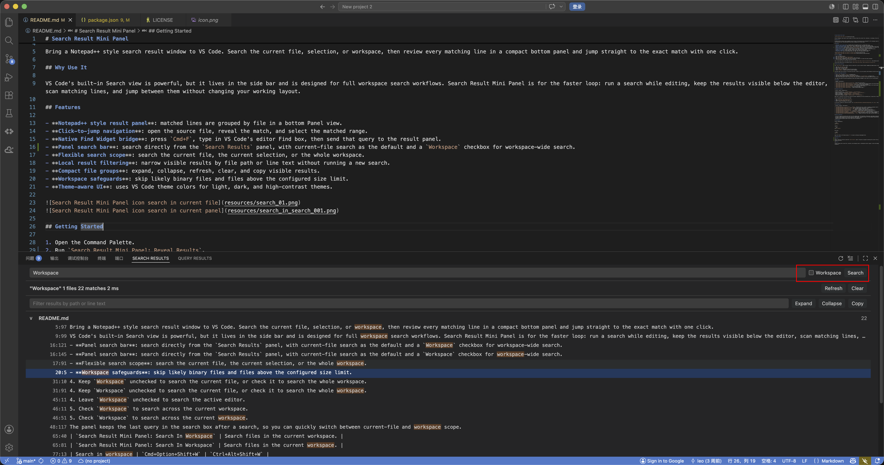
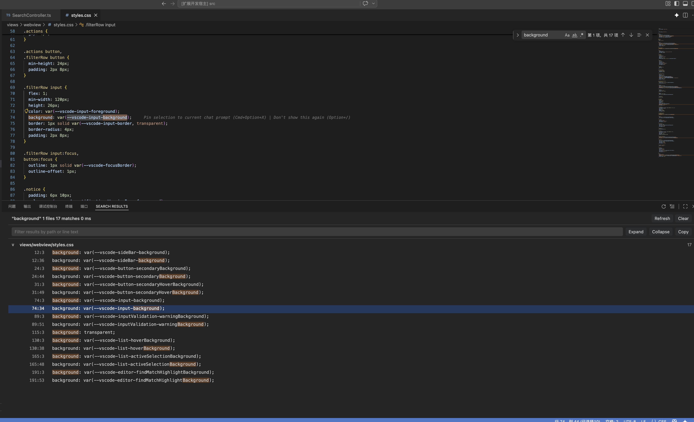
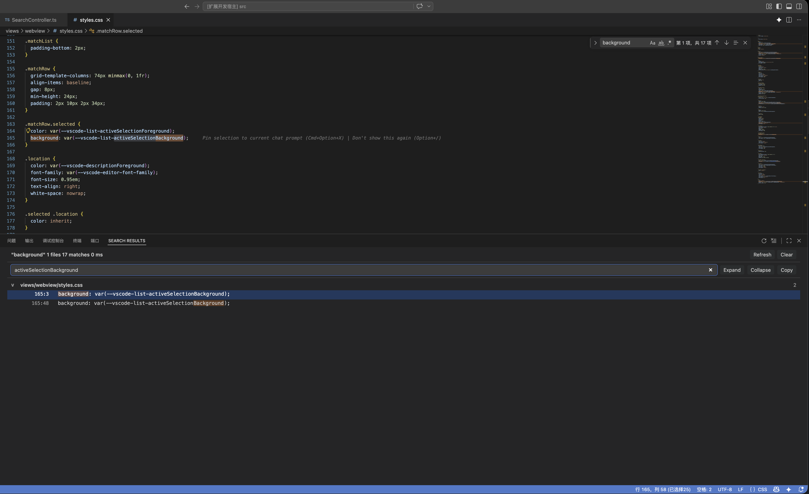

# Search Result Mini Panel

[English](README.md) | [中文](README.zh-CN.md)


Bring a Notepad++ style search result window to VS Code. Search the current file, selection, or workspace, then review every matching line in a compact bottom panel and jump straight to the exact match with one click.

## Why Use It

VS Code's built-in Search view is powerful, but it lives in the side bar and is designed for full workspace search workflows. Search Result Mini Panel is for the faster loop: run a search while editing, keep the results visible below the editor, scan matching lines, and jump between them without changing your working layout.

## Features

- **Notepad++ style result panel**: matched lines are grouped by file in a bottom Panel view.
- **Click-to-jump navigation**: open the source file, reveal the match, and select the matched range.
- **Native Find Widget bridge**: press `Cmd+F`, type in VS Code's editor Find box, then send that query to the result panel.
- **Panel search bar**: search directly from the `Search Results` panel, with current-file search as the default and a `Workspace` checkbox for workspace-wide search.
- **Flexible search scope**: search the current file, the current selection, or the whole workspace.
- **Local result filtering**: narrow visible results by file path or line text without running a new search.
- **Compact file groups**: expand, collapse, refresh, clear, and copy visible results.
- **Workspace safeguards**: skip likely binary files and files above the configured size limit.
- **Theme-aware UI**: uses VS Code theme colors for light, dark, and high-contrast themes.





## Getting Started

1. Open the Command Palette.
2. Run `Search Result Mini Panel: Reveal Results`.
3. Enter your search text in the `Search Results` panel search bar.
4. Keep `Workspace` unchecked to search the current file, or check it to search the whole workspace.
5. Click any matched line to jump to the source location.

Tip: if you select text in the editor and run `Search Result Mini Panel: Search In Current File`, the extension searches immediately with the selected text as the query.

You can also select text in the editor and run `Search Result Mini Panel: Search Selection In Current File`.

## Panel Search Workflow

The `Search Results` panel includes a built-in search bar so you can search without remembering command names or keyboard shortcuts.

1. Open the `Search Results` panel.
2. Type a query in the search bar.
3. Press `Enter` or click `Search`.
4. Leave `Workspace` unchecked to search the active editor.
5. Check `Workspace` to search across the current workspace.

The panel keeps the last query in the search box after a search, so you can quickly switch between current-file and workspace scope.

## Native Find Widget Workflow

1. Press `Cmd+F` on macOS or `Ctrl+F` on Windows/Linux.
2. Type your search query in VS Code's native editor Find box.
3. Keep the Find box focused and press `Cmd+Shift+Enter` on macOS or `Ctrl+Shift+Enter` on Windows/Linux.
4. The current Find query is sent to Search Result Mini Panel and all matches in the active editor are shown in the bottom panel.

This keeps the normal VS Code Find experience intact while adding a Notepad++ style result list for the same query.

## Commands

| Command | Description |
| --- | --- |
| `Search Result Mini Panel: Search In Current File` | Search the active editor. |
| `Search Result Mini Panel: Search Selection In Current File` | Search only the selected range in the active editor. |
| `Search Result Mini Panel: Search In Workspace` | Search files in the current workspace. |
| `Search Result Mini Panel: Show Find Widget Results` | Send the focused editor Find box query to the result panel. |
| `Search Result Mini Panel: Refresh Last Search` | Re-run the most recent search. |
| `Search Result Mini Panel: Clear Results` | Clear the result panel. |
| `Search Result Mini Panel: Reveal Results` | Show the Search Results panel. |

## Keyboard Shortcuts

| Action | macOS | Windows/Linux |
| --- | --- | --- |
| Search in current file | `Cmd+Option+Shift+F` | `Ctrl+Alt+Shift+F` |
| Search selection in current file | `Cmd+Option+Shift+S` | `Ctrl+Alt+Shift+S` |
| Search in workspace | `Cmd+Option+Shift+W` | `Ctrl+Alt+Shift+W` |
| Reveal result panel | `Cmd+Option+Shift+R` | `Ctrl+Alt+Shift+R` |
| Send native Find query to panel | `Cmd+Shift+Enter` | `Ctrl+Shift+Enter` |

When text is selected, the current-file shortcut searches immediately with that selected text. No input box or Enter key is required.

You can customize every shortcut in VS Code:

1. Open `Preferences: Open Keyboard Shortcuts`.
2. Search for `Search Result Mini Panel`.
3. Edit or remove the binding for any command.

If you want to define all shortcuts yourself, set `searchResultMiniPanel.enableDefaultKeybindings` to `false`. The native Find Widget shortcut can be disabled separately with `searchResultMiniPanel.enableFindWidgetKeybinding`.

## Configuration

| Setting | Default | Description |
| --- | --- | --- |
| `searchResultMiniPanel.maxFileSizeBytes` | `2097152` | Maximum file size, in bytes, included in workspace search. |
| `searchResultMiniPanel.maxResults` | `10000` | Maximum total matches returned by a single search. |
| `searchResultMiniPanel.maxMatchesPerFile` | `1000` | Maximum matches returned per file. |
| `searchResultMiniPanel.maxConcurrentFiles` | `8` | Number of workspace files searched concurrently. |
| `searchResultMiniPanel.defaultSearchScope` | `currentFile` | Default search scope for future UI expansion. |
| `searchResultMiniPanel.contextLines` | `0` | Number of context lines shown before and after each match. |
| `searchResultMiniPanel.excludeGlob` | `**/{node_modules,.git,out,dist,build}/**` | Files and folders excluded from workspace search. |
| `searchResultMiniPanel.revealOnStartup` | `false` | Reveal the Search Results panel when VS Code finishes starting up. |
| `searchResultMiniPanel.enableDefaultKeybindings` | `true` | Enable the default shortcut set for panel commands. |
| `searchResultMiniPanel.enableFindWidgetKeybinding` | `true` | Enable the shortcut that sends the native editor Find query to the panel. |

## Known Limitations

- The first release uses plain text search from the command input. Case-sensitive, whole-word, and regular expression options are implemented in the service layer and are planned for the panel toolbar.
- VS Code's stable extension API does not expose the Find Widget's live query object. The Find Widget bridge captures the focused Find input through VS Code commands, restores the clipboard, and then runs the panel search.
- Workspace search decodes files as UTF-8 and skips likely binary files.
- Replace and multi-session search result tabs are not included yet.

## Development

Install dependencies:

```bash
npm install
```

Compile:

```bash
npm run compile
```

Run tests:

```bash
npm test
```

Open this folder in VS Code and press `F5` to launch an Extension Development Host.

## Release Notes

### 0.2.1

Implemented `searchResultMiniPanel.contextLines`. When set above `0`, each match displays the configured number of surrounding lines, and thin separators are shown between match blocks to make contextual results easier to scan.

### 0.2.0

Added a search bar directly inside the `Search Results` panel. The panel now supports searching the current file by default, with a `Workspace` checkbox to switch to workspace search, reducing the need to remember command palette entries or keyboard shortcuts.

Added `searchResultMiniPanel.revealOnStartup`, an optional setting for revealing the `Search Results` panel after VS Code starts. It is disabled by default.

### 0.1.0

Initial release with current-file, selection, and workspace search, customizable shortcut support, native Find Widget query capture, a bottom result panel, local filtering, grouped results, copy/refresh/clear actions, and click-to-jump navigation.
