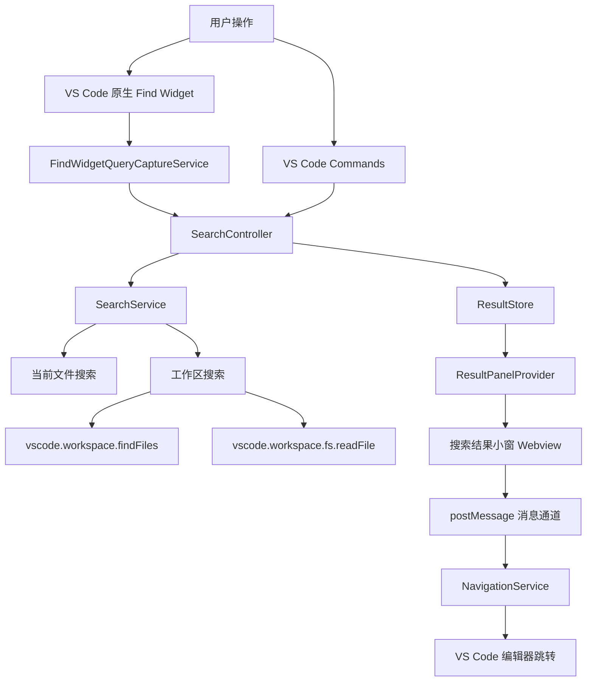

# VS Code 插件设计方案：类 Notepad++ 搜索结果小窗

## 1. 背景与目标

本插件旨在为 VS Code 提供一个类似 Notepad++ “Find result” 的搜索结果展示体验：用户在当前文件、选中文本范围、打开文件集合或整个工作区中搜索后，匹配行会集中显示在一个可停靠的小窗中，并支持点击结果快速跳转到源文件对应位置。

VS Code 已有内置全局搜索面板，但它偏向完整侧边栏工作流。本插件重点解决以下场景：

- 用户希望在编辑过程中快速查看匹配行，而不是切换到完整搜索侧栏。
- 用户希望像 Notepad++ 一样看到“文件 -> 匹配行”的紧凑列表。
- 用户希望搜索结果窗口可固定、可清空、可二次过滤、可点击跳转。
- 用户希望对当前文件的搜索结果具备轻量、即时、低打扰体验。
- 用户希望继续使用 VS Code 原生 `Cmd+F` / `Ctrl+F` Find Widget 输入搜索词，并能把同一个搜索词一键发送到插件结果小窗。
- 用户希望常用搜索动作可以通过快捷键触发，并且能够在 VS Code Keyboard Shortcuts 中自定义。

## 2. 产品定位

插件名称暂定：`Search Result Mini Panel`

核心体验：

- 搜索入口轻量。
- 搜索结果紧凑。
- 结果点击即跳转。
- 支持当前文件和工作区两类高频范围。
- 小窗可作为底部 Panel、侧边 View 或浮动 Webview 展示。

首版建议优先实现底部 Panel Webview，因为它最接近 Notepad++ 的搜索结果窗口，同时实现成本和 VS Code 兼容性较好。

## 3. 用户故事

### 3.1 当前文件搜索

作为开发者，我希望在当前文件中输入关键词后，底部小窗能列出所有匹配行，这样我可以快速在同一文件内跳转。

验收标准：

- 支持普通文本搜索。
- 支持大小写匹配开关。
- 支持正则表达式开关。
- 每条结果显示行号、列号、匹配行文本。
- 点击结果后编辑器跳转到对应位置并选中匹配内容。
- 当用户已选中单行文本并触发当前文件搜索快捷键时，直接使用选中文本作为搜索词执行搜索，不再弹出输入框等待 Enter。

### 3.2 工作区搜索

作为开发者，我希望搜索整个工作区并按文件分组展示结果，这样我可以快速浏览所有文件中的命中位置。

验收标准：

- 支持工作区文件搜索。
- 支持 glob include / exclude。
- 默认遵守 `.gitignore` 和 VS Code 搜索排除配置。
- 结果按文件路径分组。
- 文件分组可展开或折叠。
- 点击结果可打开文件并定位匹配内容。

### 3.3 搜索结果保持

作为开发者，我希望搜索结果小窗不会因为编辑器焦点变化而消失，这样我可以一边看结果一边修改代码。

验收标准：

- 小窗支持固定展示。
- 搜索结果在切换文件后仍然保留。
- 支持手动刷新当前搜索。
- 支持一键清空结果。

### 3.4 结果内过滤

作为开发者，我希望能在已有搜索结果中继续输入过滤词，这样我可以在大量匹配中快速收窄。

验收标准：

- Webview 中提供本地过滤输入框。
- 过滤仅影响结果展示，不重新扫描文件。
- 支持按文件路径和匹配行文本过滤。

### 3.5 原生 Find Widget 联动

作为开发者，我希望继续使用 VS Code 原生当前文件搜索框输入搜索词，并能直接触发 Search Result Mini Panel 展示全部匹配行，这样我不需要学习新的搜索入口。

验收标准：

- 用户通过 `Cmd+F` / `Ctrl+F` 打开 VS Code 原生 Find Widget。
- 用户在 Find Widget 中输入搜索词后，可通过插件快捷键或命令将该搜索词发送到结果小窗。
- 插件在当前 active editor 中执行搜索，并将结果展示在底部 Panel。
- 原生 Find Widget 的普通查找行为不被破坏。
- 插件触发过程不永久污染用户剪贴板。

### 3.6 快捷键自定义

作为开发者，我希望插件的常用命令都能绑定快捷键，并且我可以根据自己的习惯修改这些快捷键。

验收标准：

- 插件为当前文件搜索、选区搜索、工作区搜索、展示结果面板、原生 Find Widget 联动提供默认快捷键。
- 默认快捷键尽量避开 VS Code 内置 `Cmd+F` / `Ctrl+F`、全局搜索、替换等高频组合。
- 用户可以在 VS Code `Preferences: Open Keyboard Shortcuts` 中搜索 `Search Result Mini Panel` 并修改任意命令快捷键。
- 用户可以通过配置关闭插件默认快捷键集合，仅保留自己定义的快捷键。
- 原生 Find Widget 联动快捷键可单独关闭。

## 4. 功能范围

### 4.1 首版必备功能

- 命令面板命令：
  - `Search Result Mini Panel: Search In Current File`
  - `Search Result Mini Panel: Search In Workspace`
  - `Search Result Mini Panel: Search Selection In Current File`
  - `Search Result Mini Panel: Show Find Widget Results`
  - `Search Result Mini Panel: Clear Results`
  - `Search Result Mini Panel: Refresh Last Search`
- 搜索选项：
  - 搜索词。
  - 搜索范围：当前文件、选中文本、工作区。
  - 大小写敏感。
  - 全词匹配。
  - 正则表达式。
  - include glob。
  - exclude glob。
- 结果展示：
  - 按文件分组。
  - 展示文件路径、匹配数量。
  - 展示匹配行号、列号、上下文文本。
  - 高亮匹配片段。
  - 点击跳转。
- 结果操作：
  - 清空。
  - 刷新。
  - 展开全部。
  - 折叠全部。
  - 复制结果。
- 快捷键：
  - 默认快捷键覆盖当前文件搜索、选区搜索、工作区搜索、展示结果面板。
  - 原生 Find Widget 聚焦时支持一键发送当前 query 到结果面板。
  - 支持通过 VS Code Keyboard Shortcuts 自定义所有命令快捷键。
  - 支持通过配置关闭默认快捷键。

### 4.2 后续增强功能

- 多标签搜索会话。
- 保存搜索历史。
- 替换预览。
- 搜索结果导出为文本或 Markdown。
- 支持多根工作区更精细的分组。
- 支持文件类型快捷过滤。
- 支持在结果中显示匹配前后 N 行上下文。
- 支持跟随当前文件自动搜索。
- 支持 Search Editor 风格的可编辑结果视图。

## 5. 非目标

首版不建议做以下能力：

- 不实现跨远程机器的自定义索引服务。
- 不实现完整替换引擎。
- 不替代 VS Code 内置 Search View。
- 不扫描二进制文件。
- 不实现复杂语义搜索。

## 6. 整体架构

插件采用 VS Code Extension Host + Webview Panel 架构。



## 7. 模块设计

### 7.1 Extension Entry

文件建议：`src/extension.ts`

职责：

- 插件激活。
- 注册命令。
- 初始化核心服务。
- 注册 Webview Provider。
- 处理插件销毁。

主要对象：

- `SearchController`
- `SearchService`
- `ResultStore`
- `ResultPanelProvider`
- `NavigationService`
- `FindWidgetQueryCaptureService`

### 7.2 SearchController

文件建议：`src/controllers/SearchController.ts`

职责：

- 协调搜索流程。
- 读取用户输入。
- 组装搜索参数。
- 调用搜索服务。
- 更新结果状态。
- 打开或刷新结果小窗。

主要方法：

```ts
class SearchController {
  searchInCurrentFile(): Promise<void>;
  searchSelectionInCurrentFile(): Promise<void>;
  searchInWorkspace(): Promise<void>;
  searchFromFindWidget(): Promise<void>;
  refreshLastSearch(): Promise<void>;
  clearResults(): void;
}
```

### 7.3 SearchService

文件建议：`src/services/SearchService.ts`

职责：

- 根据搜索范围分发到不同搜索实现。
- 统一返回结构化搜索结果。
- 处理搜索取消、错误、空结果。

主要方法：

```ts
interface SearchService {
  search(request: SearchRequest, token?: vscode.CancellationToken): Promise<SearchResultSet>;
}
```

### 7.4 CurrentFileSearchEngine

文件建议：`src/search/CurrentFileSearchEngine.ts`

职责：

- 对当前打开文档或选区进行文本扫描。
- 计算行号、列号、匹配范围。
- 保持与 VS Code 文档内容一致，不额外读磁盘。

实现要点：

- 使用 `TextDocument.getText()` 获取文本。
- 使用 `TextDocument.positionAt(offset)` 将偏移转换为位置。
- 按行生成展示文本。
- 正则搜索时需要防止空匹配导致死循环。

### 7.5 WorkspaceSearchEngine

文件建议：`src/search/WorkspaceSearchEngine.ts`

职责：

- 扫描工作区文件。
- 支持 include / exclude glob。
- 跳过二进制文件和超大文件。
- 聚合每个文件中的匹配结果。

实现要点：

- 使用 `vscode.workspace.findFiles(include, exclude)` 查找候选文件。
- 使用 `vscode.workspace.fs.readFile(uri)` 读取内容。
- 使用 `TextDecoder` 解码 UTF-8。
- 对大文件设置阈值，例如默认跳过超过 `2 MB` 的文件。
- 使用批量并发控制，避免一次性读取过多文件。

建议并发：

- 默认并发数：`8`。
- 可配置：`searchResultMiniPanel.maxConcurrentFiles`。

### 7.6 ResultStore

文件建议：`src/state/ResultStore.ts`

职责：

- 保存最近一次搜索请求。
- 保存当前搜索结果。
- 通知 Webview 更新。
- 支持清空和刷新。

主要结构：

```ts
class ResultStore {
  getState(): SearchPanelState;
  setLoading(request: SearchRequest): void;
  setResults(resultSet: SearchResultSet): void;
  setError(error: SearchError): void;
  clear(): void;
  onDidChangeState: vscode.Event<SearchPanelState>;
}
```

### 7.7 ResultPanelProvider

文件建议：`src/views/ResultPanelProvider.ts`

职责：

- 创建 Webview Panel。
- 注入 HTML、CSS、JS。
- 将 ResultStore 状态推送给 Webview。
- 接收 Webview 消息并转发给对应服务。

建议首版使用 `vscode.window.createWebviewPanel`：

- View type：`searchResultMiniPanel.results`
- Title：`Search Results`
- 展示位置：`vscode.ViewColumn.Beside` 或底部 Panel 需要改用 `WebviewViewProvider`。

更接近底部小窗的方案：

- 使用 `WebviewViewProvider` 注册到自定义 view container。
- 在 `package.json` 的 `contributes.viewsContainers.panel` 中声明底部 Panel 容器。
- 在 `contributes.views` 中声明结果视图。

推荐采用底部 Panel：

```json
{
  "contributes": {
    "viewsContainers": {
      "panel": [
        {
          "id": "searchResultMiniPanel",
          "title": "Search Results",
          "icon": "resources/search.svg"
        }
      ]
    },
    "views": {
      "searchResultMiniPanel": [
        {
          "id": "searchResultMiniPanel.resultsView",
          "name": "Results"
        }
      ]
    }
  }
}
```

### 7.8 NavigationService

文件建议：`src/services/NavigationService.ts`

职责：

- 根据结果项打开文件。
- 定位并选中匹配范围。
- 聚焦编辑器。
- 支持预览打开和固定打开。

主要方法：

```ts
class NavigationService {
  openMatch(match: SearchMatch, options?: NavigationOptions): Promise<void>;
}
```

实现要点：

- 使用 `vscode.workspace.openTextDocument(uri)`。
- 使用 `vscode.window.showTextDocument(document, { preview: false })`。
- 设置 `editor.selection`。
- 使用 `editor.revealRange(range, vscode.TextEditorRevealType.InCenterIfOutsideViewport)`。

### 7.9 FindWidgetQueryCaptureService

文件建议：`src/services/FindWidgetQueryCaptureService.ts`

职责：

- 在 VS Code 原生 Find Widget 聚焦时读取当前输入框内容。
- 通过 VS Code 命令模拟“全选 + 复制”获取 query。
- 搜索触发后恢复用户原剪贴板。
- 将捕获到的 query 交给 `SearchController.searchFromFindWidget()` 执行当前文件搜索。

设计约束：

- VS Code 稳定 Extension API 不暴露 Find Widget 的 live query 对象，因此不能通过公开字段直接读取搜索框内容。
- 集成入口应绑定在 `findWidgetVisible && inputFocus` when clause 下，确保命令只在 Find Widget 输入框聚焦时触发。
- 该服务只负责捕获 query，不直接执行搜索、不持久化剪贴板内容。

主要方法：

```ts
class FindWidgetQueryCaptureService {
  captureFocusedFindInput(): Promise<string | undefined>;
}
```

## 8. 数据结构设计

### 8.1 SearchRequest

```ts
type SearchScope = 'currentFile' | 'selection' | 'workspace';

interface SearchRequest {
  id: string;
  query: string;
  scope: SearchScope;
  options: SearchOptions;
  createdAt: number;
  source?: {
    uri?: string;
    selection?: SerializedRange;
  };
}

interface SearchOptions {
  caseSensitive: boolean;
  wholeWord: boolean;
  useRegex: boolean;
  includeGlob?: string;
  excludeGlob?: string;
  maxFileSizeBytes: number;
  contextLines: number;
}
```

### 8.2 SearchResultSet

```ts
interface SearchResultSet {
  requestId: string;
  query: string;
  scope: SearchScope;
  startedAt: number;
  finishedAt: number;
  totalFiles: number;
  matchedFiles: number;
  totalMatches: number;
  files: FileSearchResult[];
  skippedFiles: SkippedFile[];
}

interface FileSearchResult {
  uri: string;
  workspaceRelativePath: string;
  fileName: string;
  matches: SearchMatch[];
}

interface SearchMatch {
  id: string;
  uri: string;
  line: number;
  character: number;
  endLine: number;
  endCharacter: number;
  previewText: string;
  matchText: string;
  rangesInPreview: PreviewRange[];
}
```

说明：

- `line` 和 `character` 内部建议使用 VS Code 的 0-based 索引。
- Webview 展示时转换为 1-based 行列。
- `uri` 在 Webview 中只作为字符串传递，跳转由 Extension Host 完成。

## 9. 搜索算法设计

### 9.1 查询编译

统一将用户输入编译为 `RegExp`。

普通文本搜索：

- 对查询文本做正则转义。
- `wholeWord` 开启时包裹单词边界。
- `caseSensitive` 关闭时追加 `i` 标志。
- 始终追加 `g` 标志以支持多匹配。

正则搜索：

- 校验正则合法性。
- 自动追加 `g`。
- 根据大小写选项决定是否追加 `i`。

伪代码：

```ts
function buildMatcher(query: string, options: SearchOptions): RegExp {
  const source = options.useRegex ? query : escapeRegExp(query);
  const wholeWordSource = options.wholeWord ? `\\b(?:${source})\\b` : source;
  const flags = options.caseSensitive ? 'g' : 'gi';
  return new RegExp(wholeWordSource, flags);
}
```

### 9.2 当前文件搜索

流程：

1. 获取当前 active editor。
2. 如果触发的是当前文件搜索命令，且当前 editor 存在非空单行选区，则将选中文本作为 query 立即执行当前文件搜索。
3. 如果没有可用单行选区，则根据命令入口弹出输入框获取 query。
4. 根据 scope 决定搜索全文或选区。
5. 编译 matcher。
6. 在文本中循环 `regexp.exec(text)`。
7. 将 offset 转为 document position。
8. 提取匹配所在行作为 preview。
9. 生成 `SearchMatch`。

边界处理：

- 空查询直接提示用户。
- 选区跨多行时不自动作为 query，继续弹出输入框，避免误用大段文本搜索。
- 正则空匹配时手动推进 `lastIndex`。
- 多行匹配首版可支持定位，但 preview 只展示起始行；后续再做多行预览。

### 9.3 工作区搜索

流程：

1. 获取工作区根目录。
2. 合并用户 include / exclude 与 VS Code 配置。
3. 使用 `findFiles` 获取候选 URI。
4. 按并发池读取文件。
5. 跳过过大文件和疑似二进制文件。
6. 对每个文件执行 matcher。
7. 汇总文件级结果。
8. 按路径排序后返回。

疑似二进制判断：

- 文件内容前若干 KB 中存在大量 `0x00` 字节则跳过。
- 或根据扩展名跳过常见二进制类型，如 `.png`、`.jpg`、`.gif`、`.pdf`、`.zip`、`.exe`。

### 9.4 性能控制

- 对工作区搜索显示进度：`vscode.window.withProgress`。
- 支持 CancellationToken 取消。
- 限制最大结果数，例如默认 `10000`。
- 限制单文件最大命中数，例如默认 `1000`。
- Webview 结果列表使用虚拟滚动，避免大量 DOM 节点。

## 10. Webview UI 设计

### 10.1 布局

底部 Panel 建议布局：

```text
┌─────────────────────────────────────────────────────────────┐
│ Search Results  query: "foo"  12 files 86 matches           │
├─────────────────────────────────────────────────────────────┤
│ [Filter results...] [Aa] [.*] [Word] [Refresh] [Clear]      │
├─────────────────────────────────────────────────────────────┤
│ ▼ src/app.ts                                      14 matches │
│   12:8   const foo = createFoo();                           │
│   26:14  if (foo.enabled) {                                 │
│                                                             │
│ ▼ src/utils/foo.ts                                3 matches  │
│   5:1    export function foo() {                            │
└─────────────────────────────────────────────────────────────┘
```

### 10.2 视觉要求

- 使用 VS Code CSS Variables 适配主题。
- 字体使用 `--vscode-editor-font-family` 或 `--vscode-font-family`。
- 行高紧凑但不拥挤。
- 匹配片段使用 `--vscode-editor-findMatchHighlightBackground`。
- 当前 hover 项使用 `--vscode-list-hoverBackground`。
- 当前选中项使用 `--vscode-list-activeSelectionBackground`。

### 10.3 交互

- 单击匹配行：打开文件并跳转。
- 双击文件标题：展开或折叠。
- 键盘上下键：移动当前选中结果。
- Enter：跳转当前选中结果。
- Cmd/Ctrl+C：复制选中结果文本。
- Cmd/Ctrl+A：选中所有可见结果。
- Filter 输入框实时过滤结果。

### 10.4 空状态与错误态

空结果：

```text
No matches found for "query".
```

错误态：

```text
Search failed: invalid regular expression.
```

跳过文件提示：

```text
5 files skipped because they exceed the configured size limit.
```

## 11. Extension 与 Webview 通信协议

### 11.1 Extension -> Webview

```ts
type ExtensionToWebviewMessage =
  | { type: 'stateChanged'; state: SearchPanelState }
  | { type: 'searchStarted'; request: SearchRequest }
  | { type: 'searchCompleted'; resultSet: SearchResultSet }
  | { type: 'searchFailed'; error: SearchError };
```

### 11.2 Webview -> Extension

```ts
type WebviewToExtensionMessage =
  | { type: 'openMatch'; matchId: string }
  | { type: 'refresh' }
  | { type: 'clear' }
  | { type: 'copyResults'; visibleOnly: boolean }
  | { type: 'updateViewState'; viewState: ResultViewState };
```

### 11.3 安全要求

- Webview 启用 nonce。
- 禁止内联脚本，或所有脚本携带 nonce。
- 设置严格 CSP。
- 不在 Webview 中直接访问本地文件。
- 所有跳转动作必须通过 Extension Host 根据 `matchId` 解析，不信任 Webview 传入的任意 URI。

## 12. 配置项设计

建议在 `package.json` 的 `contributes.configuration` 中声明：

```json
{
  "searchResultMiniPanel.maxFileSizeBytes": {
    "type": "number",
    "default": 2097152,
    "description": "Maximum file size in bytes for workspace search."
  },
  "searchResultMiniPanel.maxResults": {
    "type": "number",
    "default": 10000,
    "description": "Maximum total matches returned by one search."
  },
  "searchResultMiniPanel.maxMatchesPerFile": {
    "type": "number",
    "default": 1000,
    "description": "Maximum matches returned per file."
  },
  "searchResultMiniPanel.defaultSearchScope": {
    "type": "string",
    "enum": ["currentFile", "workspace"],
    "default": "currentFile",
    "description": "Default search scope."
  },
  "searchResultMiniPanel.respectGitIgnore": {
    "type": "boolean",
    "default": true,
    "description": "Respect .gitignore when searching workspace files."
  },
  "searchResultMiniPanel.contextLines": {
    "type": "number",
    "default": 0,
    "description": "Number of context lines shown before and after each match."
  },
  "searchResultMiniPanel.enableDefaultKeybindings": {
    "type": "boolean",
    "default": true,
    "description": "Enable Search Result Mini Panel's default shortcut set."
  },
  "searchResultMiniPanel.enableFindWidgetKeybinding": {
    "type": "boolean",
    "default": true,
    "description": "Enable the shortcut that sends the native editor Find query to the result panel."
  }
}
```

## 13. 命令与快捷键建议

### 13.1 Commands

```json
{
  "command": "searchResultMiniPanel.searchInCurrentFile",
  "title": "Search Result Mini Panel: Search In Current File"
}
```

建议命令列表：

- `searchResultMiniPanel.searchInCurrentFile`
- `searchResultMiniPanel.searchSelectionInCurrentFile`
- `searchResultMiniPanel.searchInWorkspace`
- `searchResultMiniPanel.searchFromFindWidget`
- `searchResultMiniPanel.refresh`
- `searchResultMiniPanel.clear`
- `searchResultMiniPanel.revealPanel`

### 13.2 Keybindings

默认快捷键需谨慎，避免与 VS Code 内置搜索冲突。

建议默认绑定：

| 功能 | macOS | Windows/Linux | when clause |
| --- | --- | --- | --- |
| 当前文件搜索 | `Cmd+Option+Shift+F` | `Ctrl+Alt+Shift+F` | `editorTextFocus && config.searchResultMiniPanel.enableDefaultKeybindings` |
| 选区搜索 | `Cmd+Option+Shift+S` | `Ctrl+Alt+Shift+S` | `editorTextFocus && editorHasSelection && config.searchResultMiniPanel.enableDefaultKeybindings` |
| 工作区搜索 | `Cmd+Option+Shift+W` | `Ctrl+Alt+Shift+W` | `editorTextFocus && workspaceFolderCount != 0 && config.searchResultMiniPanel.enableDefaultKeybindings` |
| 展示结果面板 | `Cmd+Option+Shift+R` | `Ctrl+Alt+Shift+R` | `config.searchResultMiniPanel.enableDefaultKeybindings` |
| 原生 Find Widget 联动 | `Cmd+Shift+Enter` | `Ctrl+Shift+Enter` | `findWidgetVisible && inputFocus && config.searchResultMiniPanel.enableFindWidgetKeybinding` |

自定义策略：

- 所有插件命令都必须通过 `contributes.commands` 暴露，确保用户能在 VS Code Keyboard Shortcuts 中搜索并改键。
- 默认快捷键只作为开箱即用体验，不能成为唯一入口。
- `searchResultMiniPanel.enableDefaultKeybindings` 用于整体关闭插件默认快捷键集合。
- `searchResultMiniPanel.enableFindWidgetKeybinding` 用于单独关闭原生 Find Widget 联动快捷键。
- 用户自定义快捷键不依赖上述开关；用户在 `keybindings.json` 中直接绑定命令即可。
- 当前文件搜索快捷键有选区优化：当 editor 中存在非空单行选中文本时，直接将选中文本作为 query 执行搜索；没有选区或选区跨多行时再显示输入框。

## 14. 文件结构建议

```text
vscode-search-result-mini-panel/
├── package.json
├── tsconfig.json
├── esbuild.js
├── resources/
│   └── search.svg
├── src/
│   ├── extension.ts
│   ├── controllers/
│   │   └── SearchController.ts
│   ├── search/
│   │   ├── CurrentFileSearchEngine.ts
│   │   ├── WorkspaceSearchEngine.ts
│   │   └── matcher.ts
│   ├── services/
│   │   ├── FindWidgetQueryCaptureService.ts
│   │   ├── SearchService.ts
│   │   └── NavigationService.ts
│   ├── state/
│   │   └── ResultStore.ts
│   ├── types/
│   │   └── search.ts
│   └── views/
│       ├── ResultPanelProvider.ts
│       └── webview/
│           ├── index.html
│           ├── main.ts
│           └── styles.css
├── test/
│   ├── matcher.test.ts
│   ├── currentFileSearch.test.ts
│   └── workspaceSearch.test.ts
└── README.md
```

## 15. 技术选型

### 15.1 Extension

- TypeScript。
- VS Code Extension API。
- esbuild 打包。
- `@vscode/test-electron` 做集成测试。

### 15.2 Webview

首版可选轻量原生实现：

- HTML + CSS + TypeScript。
- 不引入 React，降低体积和复杂度。
- 使用自定义虚拟列表或简单分片渲染。

如果后续 UI 复杂度上升，可迁移到：

- Preact。
- Svelte。

不建议首版直接上重型前端栈。

## 16. 关键实现细节

### 16.1 点击跳转

Webview 不直接传 URI 和位置，而是传 `matchId`。

流程：

1. Webview 用户点击匹配项。
2. Webview 发送 `{ type: 'openMatch', matchId }`。
3. Extension 从 `ResultStore` 查找 match。
4. `NavigationService` 打开文档。
5. 设置 selection 并 reveal range。

这样可以减少安全风险，也避免 Webview 状态被篡改后打开任意 URI。

### 16.2 匹配高亮

不要把带 HTML 的 preview 直接拼接进 Webview。

建议：

- `previewText` 作为纯文本。
- `rangesInPreview` 记录匹配起止位置。
- Webview 渲染时按 range 切片。
- 所有文本通过 `textContent` 写入 DOM。

### 16.3 搜索取消

当用户发起新搜索时，应取消旧搜索。

实现方式：

- `SearchController` 保存当前 `CancellationTokenSource`。
- 新搜索开始前调用 `cancel()`。
- Workspace 搜索在每个文件读取前检查 `token.isCancellationRequested`。

### 16.4 结果排序

建议默认排序：

1. 工作区相对路径升序。
2. 行号升序。
3. 列号升序。

后续可增加：

- 最近打开优先。
- 当前文件优先。
- 文件名匹配优先。

### 16.5 多根工作区

`workspaceRelativePath` 建议包含工作区文件夹名称：

```text
frontend/src/App.tsx
backend/src/app.ts
```

如果只有单根工作区，则展示普通相对路径。

### 16.6 原生 Find Widget 查询捕获

目标体验：

1. 用户按 `Cmd+F` / `Ctrl+F` 打开 VS Code 原生 Find Widget。
2. 用户在原生搜索框中输入 query。
3. 用户按 `Cmd+Shift+Enter` / `Ctrl+Shift+Enter`。
4. 插件读取 Find Widget 输入框内容，并执行当前文件搜索。
5. 结果展示在底部 Search Results Panel。

实现方式：

- 在 `package.json` 注册 `searchResultMiniPanel.searchFromFindWidget` 命令。
- 在 `contributes.keybindings` 中使用 `findWidgetVisible && inputFocus` 限定快捷键只在 Find Widget 输入框聚焦时启用。
- 命令执行时保存当前剪贴板内容。
- 执行 VS Code 命令 `editor.action.selectAll`，选中 Find Widget 输入框内容。
- 执行 VS Code 命令 `editor.action.clipboardCopyAction`，将 query 复制到剪贴板。
- 使用 `vscode.env.clipboard.readText()` 读取 query。
- 使用 `vscode.env.clipboard.writeText(previousClipboard)` 恢复用户原剪贴板。
- 将 query 交给 `SearchController`，按 `currentFile` scope 执行搜索。

能力边界：

- 稳定 API 不支持直接订阅原生 Find Widget query 变化，因此插件不能做到“用户每输入一个字符自动同步 Panel”，除非引入不稳定内部 API 或改为自建搜索输入框。
- 当前集成只读取搜索词；Find Widget 中的大小写、全词、正则、选区搜索等按钮状态无法通过稳定 API 直接读取。首版按插件默认搜索选项执行，后续可提供插件侧选项同步或自定义搜索输入增强。
- 剪贴板只作为短暂桥接通道，必须在 `finally` 中恢复，避免污染用户剪贴板。

## 17. 测试方案

### 17.1 单元测试

覆盖：

- 普通文本转正则。
- 正则模式。
- 大小写敏感。
- 全词匹配。
- 多匹配同一行。
- 空匹配正则。
- 多行文本 offset 到行列转换。

### 17.2 集成测试

使用 `@vscode/test-electron`：

- 打开测试工作区。
- 执行当前文件搜索命令。
- 校验 ResultStore 状态。
- 执行工作区搜索命令。
- 点击或模拟 `openMatch` 消息。
- 校验编辑器 selection。

### 17.3 Webview 测试

可使用较轻量策略：

- 抽离结果过滤和分组逻辑为纯函数。
- 对纯函数做单元测试。
- Webview DOM 交互用 Playwright 或 jsdom 做少量关键路径测试。

### 17.4 手工验收清单

- 当前文件搜索正常。
- 选中文本搜索正常。
- 工作区搜索正常。
- 无工作区时提示清晰。
- 正则错误提示清晰。
- 大文件被跳过并显示说明。
- 点击结果能打开并定位文件。
- 文件路径包含空格和中文时正常。
- 深色主题和浅色主题都可读。
- 大量结果下滚动不卡顿。

## 18. 发布计划

### Phase 1：最小可用版本

目标：能完成当前文件搜索并在 Panel 展示结果。

内容：

- 插件脚手架。
- 当前文件搜索。
- ResultStore。
- Webview Panel。
- 点击跳转。
- 清空结果。

交付物：

- 可运行 VSIX。
- 基础 README。
- 当前文件搜索测试。

### Phase 2：工作区搜索

目标：支持工作区文件扫描并按文件分组展示。

内容：

- WorkspaceSearchEngine。
- include / exclude glob。
- 大文件跳过。
- 搜索进度和取消。
- 刷新最近一次搜索。

交付物：

- 工作区搜索测试。
- 性能基准记录。

### Phase 3：交互增强

目标：让结果窗口接近 Notepad++ 使用体验。

内容：

- 展开折叠。
- 本地结果过滤。
- 复制结果。
- 键盘导航。
- 搜索历史。

交付物：

- Webview 交互测试。
- 用户配置项完善。

### Phase 4：稳定与发布

目标：准备发布到 VS Code Marketplace。

内容：

- 完善 README 截图。
- 增加 CHANGELOG。
- 增加 LICENSE。
- 配置 CI。
- 打包 VSIX。
- Marketplace 发布配置。

交付物：

- `0.1.0` 首个公开版本。

## 19. 风险与应对

### 19.1 大工作区搜索性能

风险：

- 工作区文件过多时搜索慢，甚至卡住 Extension Host。

应对：

- 限制并发。
- 限制文件大小。
- 支持取消。
- 优先使用 include glob 缩小范围。
- 后续考虑 ripgrep 子进程方案，但首版优先使用 VS Code API 保持可移植。

### 19.2 Webview 大量结果卡顿

风险：

- 一次渲染数万条结果导致 Webview 卡顿。

应对：

- 限制最大结果数。
- 使用虚拟滚动。
- 分批渲染。
- 默认折叠文件分组。

### 19.3 正则表达式灾难性回溯

风险：

- 用户输入复杂正则导致搜索耗时异常。

应对：

- 提供取消。
- 设置文件级超时或结果上限。
- 文档说明复杂正则可能影响性能。

### 19.4 编码问题

风险：

- 非 UTF-8 文件解码异常或显示乱码。

应对：

- 首版默认 UTF-8。
- 读取失败时记录 skipped。
- 后续支持 `jschardet` 或 VS Code 文档打开方式读取。

### 19.5 原生 Find Widget API 限制

风险：

- VS Code 稳定 API 不暴露 Find Widget live query 和按钮状态，直接读取原生搜索框存在能力边界。

应对：

- 使用 `findWidgetVisible && inputFocus` 限定触发环境。
- 通过“全选 + 复制 + 恢复剪贴板”的方式读取当前 query。
- 文档中明确该方式只同步搜索词，不同步 Find Widget 的正则、大小写、全词等 UI 状态。
- 后续可增加插件自有搜索输入栏，或通过 `editor.actions.findWithArgs` 反向把插件查询写入原生 Find Widget。

## 20. 未来扩展方向

- 替换预览：在结果小窗中显示替换前后差异。
- 结果固定：允许多个搜索结果会话并排保留。
- 搜索模板：保存常用搜索条件。
- 代码上下文：为函数、类、Markdown 标题等结构化上下文分组。
- Remote 优化：针对 SSH / WSL / Dev Container 优化文件读取策略。
- 与内置 Search View 联动：从内置搜索复制查询参数到插件面板。
- 与原生 Find Widget 双向联动：支持从 Panel 查询写入 Find Widget，并在插件 UI 中显式控制大小写、全词和正则选项。

## 21. 推荐首版实现路线

建议先实现以下闭环：

1. 初始化 VS Code 插件项目。
2. 注册 `searchInCurrentFile` 命令。
3. 弹出输入框获取搜索词。
4. 当前文件内搜索并生成 `SearchResultSet`。
5. 创建底部 Panel Webview。
6. 渲染结果列表。
7. 点击结果跳转并选中匹配项。
8. 增加清空和刷新。
9. 增加原生 Find Widget 查询捕获命令和受限快捷键。
10. 补单元测试。
11. 再扩展工作区搜索。

这个顺序能最快验证核心体验：搜索、展示、点击跳转。核心体验稳定后，再投入工作区搜索和大结果集优化会更稳。
